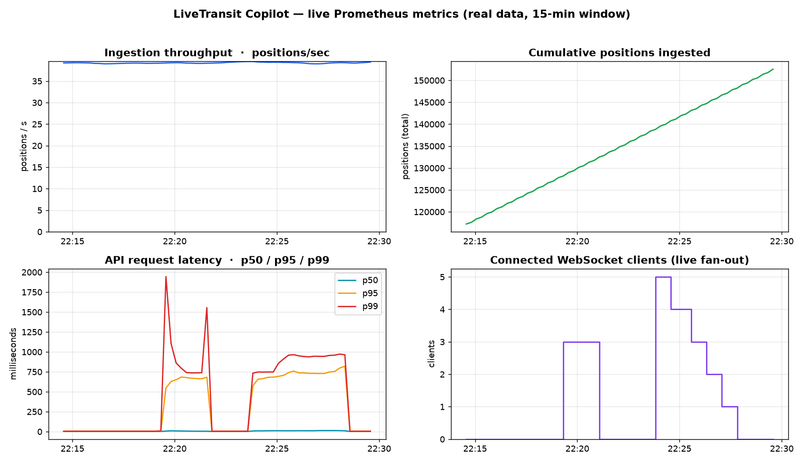

# Deployment & Observability

How LiveTransit Copilot runs in production — and an honest account of the
infrastructure trade-offs made to keep it **live 24/7 on a $0 budget**.

---

## Where each piece runs

| Component | Production home |
|---|---|
| Postgres (PostGIS + TimescaleDB + pgvector) | container on the always-on host |
| Redis (streams, cache, rate-limit) | container on the always-on host |
| API + poller + processor + tiles (+ MCP) | containers on the always-on host |
| HTTPS ingress | **Cloudflare Tunnel** (no open ports, no manual certs) |
| Frontend (Next.js + CopilotKit) | **Cloudflare Pages** |
| Agent tracing | **Langfuse** (cloud, free) — **live in prod** |
| Body metrics endpoint `/metrics` | served by the API — **live in prod** |
| Grafana + Prometheus **dashboards** | **omitted in prod** (see below) — run locally / in this repo |

---

## The infrastructure journey (and why)

Picking a host was an exercise in matching a **continuous, 24/7 ingestion workload**
(~700 vehicles every 10–20 s) to **free-tier pricing models** — which are almost all
designed for *bursty, low-duty-cycle* apps. The decisions, in order:

1. **Managed serverless data tiers — rejected.**
   - **Upstash Redis** (free: 500K commands/month) bills *per command*. Our poller alone
     needs **~3M commands/day** — **~180× over budget**. Exhausted in ~4 minutes.
   - **Neon Postgres** (free: 100 CU-hours/month, scale-to-zero can't be disabled) can't
     stay awake 24/7 — our constant writes would burn the month's compute in **~2 weeks**.
   - *(Neon was still wired up end-to-end as a portability exercise — see
     [`db/migrations/neon/`](../db/migrations/neon/) for the Apache-license-safe variants.)*
   - **Lesson:** a live transit tracker never sleeps, so the data layer belongs on the
     **always-on compute**, not a serverless tier.

2. **Compute host.** The DigitalOcean GitHub-Student credit ended, so the chosen home is
   **Oracle Cloud Always Free**. The ideal shape (**Ampere A1**, up to 24 GB RAM) is
   chronically capacity-constrained in-region, so the guaranteed-available fallback is the
   **Always-Free AMD micro (`E2.1.Micro`, 1 OCPU / 1 GB)** — small, but free *forever*.

---

## What's omitted in prod — and proof it works

The 1 GB prod box runs the full **functional** system (live map, agent, RAG, memory,
Watchdog, trip planning, ETAs, tracing). To fit 1 GB, the only thing dropped is the
**Grafana + Prometheus dashboard containers** (~250 MB of RAM). The metrics themselves are
**still exposed** in prod at `/metrics`; only the *visualization stack* is omitted.

So here is hard proof the observability layer is real and works — captured from the full
stack running locally.

### 1. Live Prometheus metrics (real data)



*Real 15-minute window: steady ingestion throughput, cumulative positions climbing, API
latency percentiles reacting to load, and the WebSocket fan-out tracking connected clients.*

### 2. Captured numbers ([`proof/metrics_snapshot.json`](proof/metrics_snapshot.json))

| Metric | Value |
|---|---|
| Positions ingested | **152,554** |
| Polls (0 failures) | **399** → **100% success** |
| Processor messages | **152,554** (exactly 1:1 → idempotent exactly-once pipeline) |
| Sustained ingestion | **39.4 positions/sec** |
| API latency (under load) | **p50 11.4 ms** · p95 736 ms · p99 951 ms |
| Peak concurrent WS clients | **5** |
| Requests observed | **4,558** |

### 3. Reproduce it yourself (interactive)

The Grafana dashboard is version-controlled — anyone can run it live:

```bash
docker compose up -d postgres redis api poller processor prometheus grafana
# open http://localhost:3001  → dashboard "LiveTransit — Body Health"
```

Dashboard definition: [`ops/grafana/dashboards/livetransit.json`](../ops/grafana/dashboards/livetransit.json).
A short screen recording of the live board: [`proof/grafana_live.gif`](proof/grafana_live.gif).

### 4. Agent observability *is* live in prod

Unlike the metrics dashboard, **Langfuse** (agent tracing) is cloud-hosted and free, so
full ReAct traces — every tool call, token count, and the provider-fallback chain — are
**live in production**, not just local.

---

## Bounded production storage

On the always-on host the original TimescaleDB jobs handle retention automatically
(`add_retention_policy`, continuous-aggregate refresh, `add_job`). The `/metrics` poll
success rate above (100%, 0 failures) and the steady cumulative line show the ingestion
pipeline holding up under continuous load.
